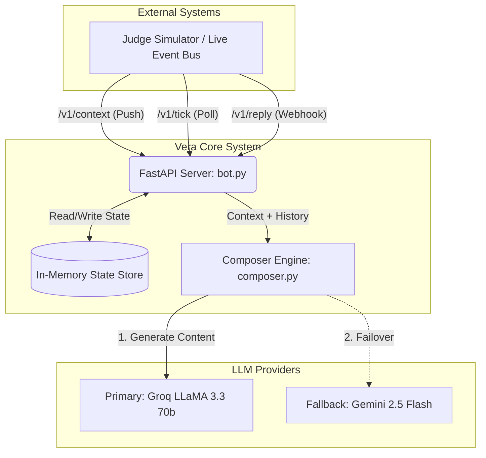

# High-Level Design (HLD): Vera Merchant AI Assistant

## 1. System Overview
Vera is a stateful, AI-powered Merchant Assistant designed to generate high-converting, context-aware WhatsApp messages for magicpin merchants. It processes four layers of context (Category, Merchant, Trigger, Customer) and uses large language models (LLMs) to compose highly specific, personalized engagement messages.

## 2. Architecture Diagram

## 3. Core Components

### 3.1 REST API Gateway (`bot.py`)
Handles all incoming network requests. It must be resilient, adhering to a strict 10 req/s rate limit and <30s timeout SLA.
- **Context Ingestion (`/v1/context`)**: Receives payload data, checks versions, and idempotently upserts the state store.
- **Proactive Tick (`/v1/tick`)**: Periodically invoked to scan available triggers, determine execution eligibility (suppression/expiration), and dispatch to the composer.
- **Multi-turn Reply (`/v1/reply`)**: Handles merchant and customer replies, maintains conversation tracking, and routes messages based on intent (Hostile, Commitment, Query, Auto-reply).

### 3.2 State Store (In-Memory)
Given the ephemeral nature of the challenge and SLA limits, state is tracked locally in memory using standard Python dictionaries.
- **Contexts Hash**: `(scope, id) -> {version, payload}`
- **Conversation State**: `conversation_id -> {merchant_id, customer_id, trigger_id, turns[], sent_bodies[], auto_reply_count}`

### 3.3 AI Composition Engine (`composer.py`)
The intelligent core of Vera. Responsibilities include:
- **Routing**: Mapping trigger kinds (e.g., `perf_dip`, `festival_upcoming`) to precise psychological levers (loss aversion, urgency).
- **Context Assembly**: Condensing the massive 4-layer context payload into dense, specific prompt blocks.
- **Dual-LLM Client**: Wrapping Groq (primary) and Google GenAI/Gemini (fallback) with automatic per-provider timeouts and failover logic for extreme reliability.
- **Validation Pipeline**: Filtering taboo words, ensuring strict CTA formatting (binary vs. open-ended), and ensuring language compliance (Hinglish code-mixing).

## 4. Key Design Decisions & Trade-offs
1. **In-Memory Storage over DB**: Prioritizes sub-millisecond lookups required for the 30s tick timeout. Given that contexts are pushed periodically and state drops on `/v1/teardown`, an external DB (Postgres/Redis) introduces unnecessary latency for the local evaluator.
2. **Deterministic LLM Output**: Setting `temperature=0` across all LLMs ensures consistent formatting, structured JSON output stability, and predictable scoring.
3. **Dual-LLM Strategy (Groq-primary)**: Groq `llama-3.3-70b` is the primary — it returns valid JSON in ~1-2s, comfortably inside the 30s tick SLA even for a full 20-action batch. Gemini 2.5 Flash is the fallback (it is a thinking model with variable 5-13s latency, so it needs a larger output-token budget and a longer timeout — acceptable only on the rare fallback path). Each provider gets a single fast-fail attempt with its own timeout (`_GROQ_TIMEOUT_S=6`, `_GEMINI_TIMEOUT_S=15`); no SDK-level retry storms. If both fail, a grounded non-LLM fallback composes from the trigger payload so a trigger is never dropped.
